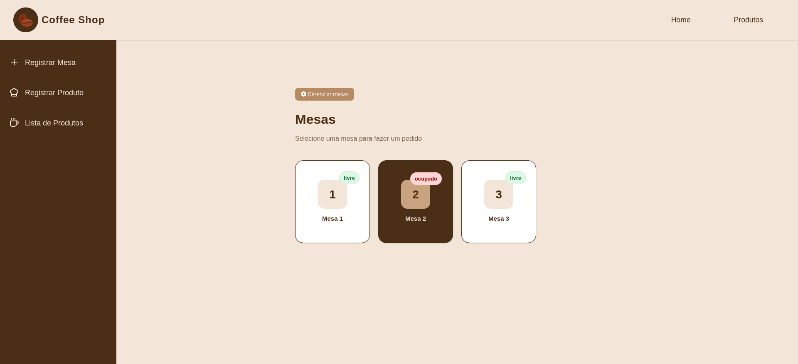

# ☕ Cardápio Café


Projeto de **cardápio digital para cafeteria**, desenvolvido com **front-end em HTML, CSS e JavaScript** e **back-end em Node.js**, seguindo **arquitetura MVC** e boas práticas de organização e escalabilidade.

---

## 📸 Preview
<p align="center">
  
</p>
---

## 🎯 Objetivo do Projeto

- Este projeto foi desenvolvido com o objetivo de praticar desenvolvimento full-stack, aplicando:
- Integração front-end e back-end
- Arquitetura MVC
- Uso de ORM (Sequelize)
- Organização de código e boas práticas
- Simulação de um sistema real de cardápio digital

## 🚀 Funcionalidades

- 📋 Listagem de produtos do cardápio
- ☕ Cadastro, leitura e organização de itens (cafés, bebidas, etc.)
- 🔄 Integração entre front-end e back-end
- 🗂️ Estrutura MVC no back-end
- 🛢️ Persistência de dados com banco SQL
- 📱 Interface simples e responsiva

---

## 🛠️ Tecnologias Utilizadas

### Front-end
- HTML5  
- CSS3  
- JavaScript  

### Back-end
- Node.js  
- Express.js  
- Sequelize ORM  
- SQL  
- Arquitetura MVC (Model, View, Controller)

---

## 🧱 Arquitetura do Projeto

O back-end segue o padrão **MVC**, separando responsabilidades:

- **Model**: definição das entidades e comunicação com o banco de dados
- **Controller**: regras de negócio e controle das requisições
- **Routes**: definição das rotas da aplicação
- **Config**: configuração do banco de dados e Sequelize

Essa organização facilita manutenção, escalabilidade e leitura do código.

---

## 📂 Estrutura do Projeto

```bash
cardapiocafe/
├── backend/
│   ├── src/
│   │   ├── controllers/     # Controllers da aplicação
│   │   ├── models/          # Models (Sequelize)
│   │   ├── routes/          # Rotas da API
│   │   ├── config/          # Configurações (DB, Sequelize)
│   │   └── app.js           # Configuração do Express
│   └── server.js            # Inicialização do servidor
│
├── frontend/
│   ├── index.html           # Página principal
│   ├── css/
│   │   └── style.css        # Estilos
│   └── js/
│       └── script.js        # Lógica do front-end
│
├── package.json
├── README.md
```
## ▶️ Como Executar o Projeto

# Back-end
1. Clone o repositório: 
```
git clone https://github.com/Astaphaanos/cardapiocafe.git
```
2. Acesse a pasta do backend:
```
cd cardapiocafe/backend
```
3. Instale as dependências:
```
npm install
```
4. Configure o banco de dados no arquivo de configuração do Sequelize.
5. Inicie o servidor:
```
npm run dev ou npm start
```

# Front-end
1. Acesse a pasta do front-end:
```
cd cardapiocafe/frontend
````
## 🔮 Possíveis Melhorias Futuras

- 🔐 Autenticação de usuário
- 🛒 Carrinho de pedidos
- 📊 Painel administrativo
- 🌙 Modo escuro
- 🚀 Deploy do back-end
- 🧪 Testes automatizados

## 👩‍💻 Desenvolvedora
Feito com 💙 por Astaphanos 
🔗 GitHub: https://github.com/Astaphaanos
